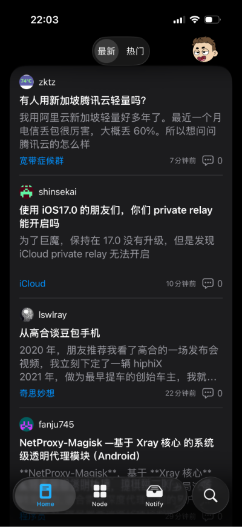
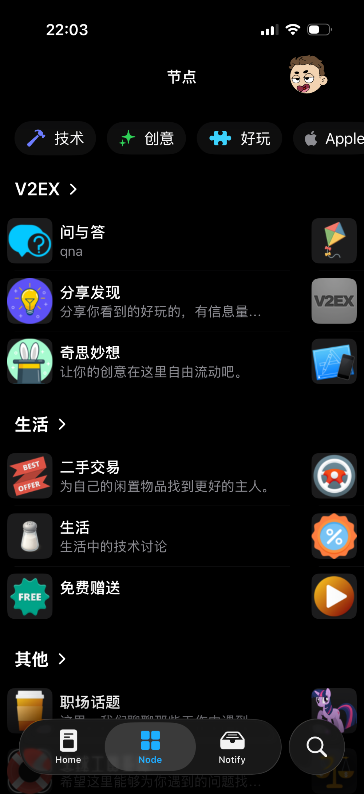
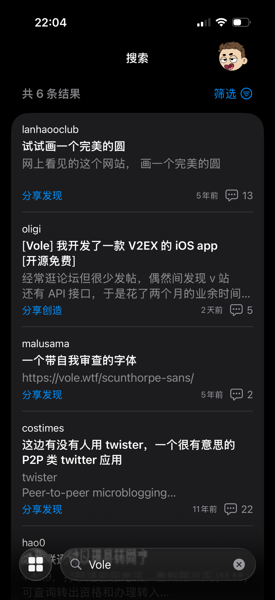

# Vole

> 一款基于[V2exAPI](https://www.v2ex.com/help/api)开发的 __V2ex__ iOS 客户端

## 特点

- 🤩 美观：纯SwiftUI实现，体验上更符合iOS设计规范
- 🤖 简单：使用V2ex官方API，相比Cookie代理方式更加简单
- 📚 丰富：支持对话展示、节点集合、站内搜索等功能
- 🌍 开源：代码完全开源，欢迎PR
- 💰 免费：完全免费，无任何广告

## 截图

## 下载

todo

## License

GPL-3.0 License, see the [LICENSE](./LICENSE) file for details.

## 捐赠

如果你觉得这个项目对你有帮助，欢迎捐赠支持我继续开发和维护这个项目。
- 微信支付：扫描下方二维码

    

- 支付宝支付：扫描下方二维码

    
